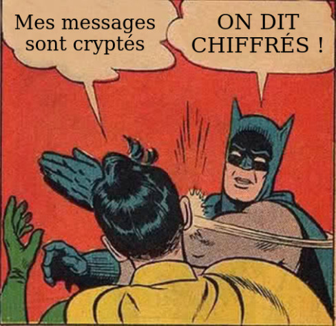

# FCSC 2024 Noise (Harder)

Noise est la nouvelle application de chat 100% securisée, grâce a son tunnel start-to-start, vos messages sont cryptés de bout en bout. Vous pouvez même partager des secrets avec vos amis, c’est pas génial ça ?

Le fichier ```noise-fix.patch``` donne le patch appliqué au code source de l’épreuve ```Noise```.

Une version plus simple de cette épreuve est disponible : ```Noise```.





Auteur : BitK

Origine : [Noise (Harder)](https://hackropole.fr/fr/challenges/web/fcsc2024-web-noise-harder/)


-----------

## Connectez vous

> http://localhost

-----------

## Installation manuel
Vous n'utilisez pas l'application **les CTFs de Cyrhades** ? C'est dommage !
Mais voici comment installer ce CTF manuellement :

> git clone https://github.com/Hack-Oeil/fcsc2024-web-noise-harder.git

> cd fcsc2024-web-noise-harder


-----------

## Sur le site officiel hackropole.fr
> https://hackropole.fr/fr/challenges/web/fcsc2024-web-noise-harder/